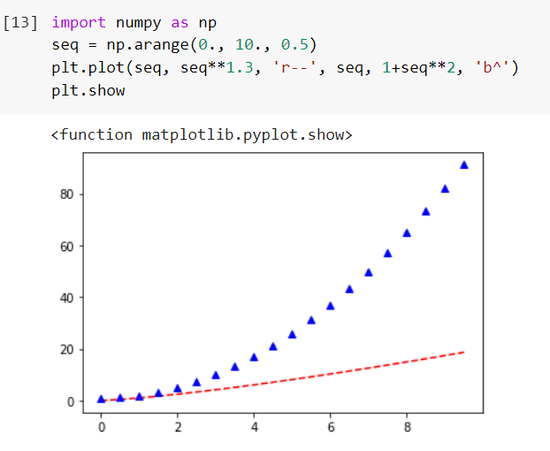
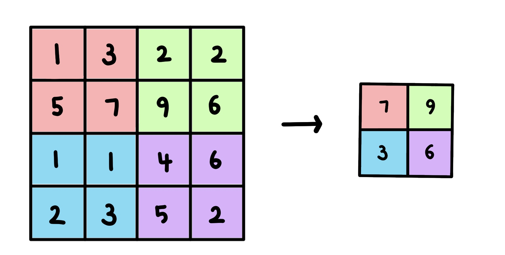

<h1 align="center"> 🙌🏻 자연어 처리(NLP) 🙌🏻 </h1>
🌱 2021.01.23 - 2021.02.10  
🌱 Natural Language Processing_HUFS_AI_CAMP 

## ✨ Day 0 

<b>Introduction</b>
 
<b>Google Colab</b> 및 <b>Slack</b>의 조작 방법 익히기  
<b>Numpy, Tensorflow, Matplotlib, Pandas</b>에 대한 기본 지식 학습하기  

## ✨ Day 1

<b>1.1 단어 분류 프로젝트</b>
 
sentences를 입력 받아 구성하는 단어가 긍정인지, 중립인지, 부정인지 분류하는 프로젝트를 만들어 본다.  
이때 단어의 긍정은 2, 중립은 1, 부정은 0으로 표시하며, 예를 들어 "나는 오늘 기분이 좋아" 라는 문장의 경우 띄어쓰기를 기준으로 split()하여 <b>[1, 1, 1, 2]</b>를 출력한다. 
단어 분류 프로젝트는 데이터를 통해 Vocabulary를 생성 -> 학습용 데이터 생성 -> 모델링 -> 학습 -> 평가 -> 예측을 통해 진행된다. 실습 내용은 <a href = "https://github.com/bbjoite09/NLP/blob/main/Practice/1.1%20simple%20word%20project.ipynb">여기</a>에서 확인할 수 있다.

<b>📝 1.2 문장 분류 프로젝트</b>
 
위의 단어 분류 프로젝트와 비슷하게 입력받은 문장이 긍정인지, 부정인지 분류하는 프로젝트를 만들어 본다. 
위와 유사하게, 단어의 긍정은 1, 부정은 0로 표시한다. "나는 오늘 기분이 좋아" 라는 문장의 경우 <b>1 : 긍정</b>을 출력하도록 한다. 
실습 내용은 <a href = "https://github.com/bbjoite09/NLP/blob/main/Practice/1.2%20simple%20sentence%20project.ipynb">여기</a>에서 확인할 수 있다.

## ✨ Day 2

<b>2.1 Encodding</b>
 
첫번째로 데이터를 표현하는 방법에 대하여 학습하였다. 
Text data의 경우 입력받은 문장을 중복을 제거하여 Tokenizer 한 후 각 Token에 대하여 index를 부여한다. 이후 Encoding을 진행한다. 이때 여러가지의 Encoding 중 One hot encoding에 대한 실습을 진행하였다.  
One hot encoding은 위에서 받은 Token의 집합, 즉 단어의 집합을 벡터 차원의 크기로 만들고 원하는 한개의 단어 인덱스에만 1, 나머지 단어들에는 0을 부여하는 벡터 표현 방식이다. 
실습 내용은 <a href = "https://github.com/bbjoite09/NLP/blob/main/Practice/2.1%20encoding.ipynb">여기</a>에서 확인할 수 있다.  

<b>2.2 Tokenizer</b>
 
Tokenize란 문장을 일정한 규칙을 통해 토큰 단위로 나누는 과정을 말한다. 
실습 2.1에서 입력받은 sentence 데이터를 Tokenize 하여, 나누어진 Token에 고유한 번호를 부여해 Vocabulary를 생성하였다. 이를 진행할때는 Token의 개수, Vocabulary의 개수를 고려하여 미등록 단어를 최소화 하되, 효율적으로 Tokenizer 할 수 있도록 설계해야 한다.  

- Char Tokenizer : 글자 단위로 단어를 Tokenize 한다. 이는 작은 수의 vocabulary로 모든 문장을 표현 가능하도록 하나, 각 토큰들은 단어의 고유 의미를 표현하지 못한다는 단점이 있다. 
- Word Tokenizer : 띄어쓰기 단위로 단어를 Tokenize한다. 이는 구현이 쉬우나 어미 변화에 따른 유사 Token이 많아지고, 이 단어들이 비슷한 벡터를 가지지 않을 수 있다는 단점이 있다. 또한 이는 데이터가 많아질 수 록 vocaburlary 개수가 증가한다는 단점이 있다. 
- BPE(Byte Pair Encoding) : 빈도수를 기반으로 계산하여 subword 단위로 단어를 Tokenize한다. 이는 현재 가장 많이 사용되는 Tokenize 방식으로, subwords단위로 tokenize하기 때문에 미등록 단어를 최소화한다는 장점이 있다. 한편 vocab 수를 작게하였을 때 subwords가 많이 생겨 token 수가 많아진다는 단점이 있다.  
위의 내용에 대한 실습은 <a href = "https://github.com/bbjoite09/NLP/blob/main/Practice/2.2%20tokenizer.ipynb">여기</a>에서 확인할 수 있다.  

<b>📝 2.3 Tokenizer</b>
 
my_corpus라는 새로운 말뭉치로 Tokenizer 실습을 진행하였다. 
해당 실습에 대한 내용은 <a href = "https://github.com/bbjoite09/NLP/blob/main/Practice/2.3%20tokenizer.ipynb">여기</a>에서 확인할 수 있다. 

## ✨ Day 3

<b>3.1 matrix equation</b>
 
행렬의 기본 연산에 대하여 학습하였다. 
해당 실습에 대한 내용은 <a href = "https://github.com/bbjoite09/NLP/blob/main/Practice/3.1%20matrix%20equation.ipynb">여기</a>에서 확인할 수 있다.

<b>3.2 word embedding</b>
 
<b>Word Representation</b>  
  
- 시소러스(ex. WordNet) : 사람이 단어의 의미를 직접 정의하는 방식을 말한다. 이는 단어의 유의어 집합을 생성한 후, 각각의 연결을 정의하여 이들간의 관계를 표현한다. 이는 쉽다는 장점이 있는 한편, 시대의 변화에 따른 대응이 어렵고, 비용이 높다는 문제를 야기하면서 비효율을 초래한다.
- Distributional semantics(ex. Word2Vec): outer word들이 center word를 표현하는 방식을 말한다. 즉, 단어 그 자체의 의미보다는 문맥의 흐름을 통하여 단어의 의미를 형성한다. 단어의 의미를 여러 차원에 분산하여 표현하여 단어간 유사도를 계산할 수 있다.
- 이외에도 통계기반 기법, 동시발생 행렬 등 단어를 표현하는 다양한 방법이 존재한다.  

<b>Word2Vec</b>  
어떤 text data에 대하여 모든 단어는 벡터로 표현된다. 이 단어 벡터들은 유사도를 반영한 값을 가지고 있으며, 어떤 시점 t에는 중심 단어 c와 주변 단어 o가 있다. c에 대하여 o가 나타날 확률을 계산할 때 이 벡터의 유사성을 이용한다. 우리는 단어의 벡터를 변경하여 c에 대해 o가 나타날 확률을 최대화 할 수 있다.  

- Skip-Gram : 하나의 중심단어를 통해 주변 단어를 예측한다.
- CBOW(Continuous Bag of Words) : 여러 주변 단어를 통해 중심 단어를 예측한다.  

Word2Vec은 Skip-Gram과 CBOW 두가지 방식이 존재한다. 두 방법 모두 window size를 지정하여, center word 중심으로 몇개의 주변 단어를 살펴볼지 결정한다. 예를들어 Skip-Gram 에서 window size가 2라고 하면 중심 단어를 기준으로 하여 앞 뒤 2개의 단어를 예측한다. 해당 내용에 대한 실습은 <a href = "https://github.com/bbjoite09/NLP/blob/main/Practice/3.2%20word%20embedding.ipynb">여기</a>에서 확인할 수 있다.

<b>📝 3.3 word embedding</b>
 
OKT 형태소 분석기와 네이버 영화 리뷰 데이터(nsmc), gensim으로 한국어를 학습시킨 후 단어 연산 프로젝트를 진행해 본다. 예를들어 "왕 - 남자 + 여자"라는 연산에 대하여 "여왕" 혹은 이와 유사한 단어를 출력하도록 한다. 해당 실습 내용은 <a href = "https://github.com/bbjoite09/NLP/blob/main/Practice/3.3%20word%20embedding.ipynb">여기</a>에서 확인할 수 있다. 

## ✨ Day 4

<b>4.1 CNN</b>
 

CNN(Convolution Neural Network)에 대하여 학습한다. 
CNN은 주로 이미지 인식에 많이 사용되며, 차원이 높은 데이터를 신경망으로 학습시킬 때는 1차원으로 평면화를 진행해야 한다. 이때 차원을 줄이는 과정에서 공간 정보가 유실되어 학습이 비효율적으로 이루어질 수 있는데, 이를 대비하여 CNN 모델을 사용한다. CNN은 이러한 공간 정보를 유지한 상태로 학습이 가능하도록 만든 모델이다.  

- Convolution : 합성 곱을 말한다. Input 값에 대하여 filter(kernel)을 이동시켜 겹쳐지는 각 원소의 값을 곱한 후 모두 더하여 계산할 수 있다.
- stride : kernel을 한번에 이동하는 간격을 말한다.
- padding : padding의 값에 따라 Input의 상하좌우에 PAD가 둘러진다. 이때 PAD는 주로 '0'을 사용한다.
- MaxPooling : overfitting을 방지하기 위하여 큰 값을 추출해 낸다. stride가 2라고 할 때 아래의 데이터를 max pooling하면 7, 9, 3, 6의 결과를 얻을 수 있다.

<b>4.2 Activation</b>
 

<b>4.3 RNN</b>
 
  

<b>📝 4.4 simple project with RNN & CNN</b>
 
Day1에서 진행하였던 simple word project와 simple sentence project에 대하여 CNN과 RNN을 적절히 추가하여 프로젝트를 변경해본다. 
해당 실습 관련 내용은 <a href = "htt
ps://github.com/bbjoite09/NLP/blob/main/Practice/4.4%20simple%20project%20with%20rnn_cnn.ipynb">여기</a>에서 확인할 수 있다.

## ✨ Day 5

<b>4.1 CNN</b>
 

## ✨ Day 6

<b>4.1 CNN</b>
 

## ✨ Day 7

<b>7.1 Language model</b>
 

<b>7.2 Language model hw1 & language model hw2</b>
 
  
  7.1을 직접 학습시켜본다. 
  실습결과는 <a href = "https://github.com/bbjoite09/NLP/blob/main/Practice/7.2%20language%20model%20hw1.ipynb">HW1</a> 또는 <a href = "https://github.com/bbjoite09/NLP/blob/main/Practice/7.3%20language%20model%20hw2.ipynb">HW2</a>에서 확인할 수 있다.

## ✨ Day 8

<b>4.1 CNN</b>
 

## ✨ Day 7

<b>4.1 CNN</b>
 
